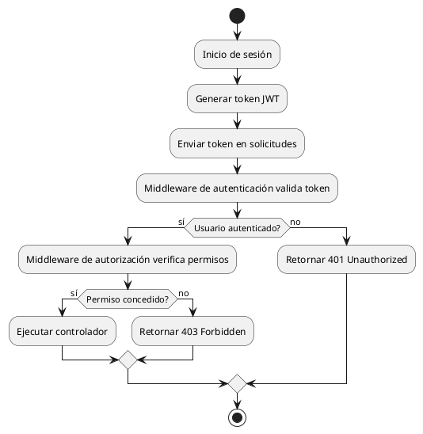

# Autorización 


En aplicaciones web, una vez que se valida la identidad de un usuario mediante **autenticación**, es necesario determinar **qué recursos y acciones puede ejecutar**. Este proceso se denomina **autorización**.

En Slim Framework v4, la autorización se implementa mediante **middlewares**, que interceptan solicitudes antes de llegar a los controladores. Los middlewares permiten evaluar roles, permisos o cualquier condición de acceso sin alterar la lógica principal de la aplicación.

---

## Conceptos

| Concepto      | Definición                                                                      |
| ------------- | ------------------------------------------------------------------------------- |
| Autenticación | Verificar identidad mediante credenciales o tokens (JWT, usuario/contraseña).   |
| Autorización  | Determinar recursos o acciones accesibles para un usuario.                      |
| Middleware    | Componente que procesa solicitudes y respuestas antes o después de la ruta.     |
| Roles         | Categorías de usuarios que agrupan permisos (ej.: `admin`, `editor`, `lector`). |
| Permisos      | Acciones específicas que un usuario puede ejecutar (ej.: `crear_usuario`).      |

> **Tip:** mantener la autenticación y la autorización separadas para una implementación clara y segura.

---

## Flujo general de autorización

El flujo típico de autorización en Slim v4 se puede representar así:




---

## Implementación en Slim Framework v4

### Dependencias

Instalar librerías necesarias con Composer:

```bash
composer require slim/slim:^4 nyholm/psr7 firebase/php-jwt
```

* **Slim**: Framework principal.
* **Nyholm/psr7**: Implementación PSR-7 para requests/responses.
* **Firebase/php-jwt**: Generación y validación de JWT.

---

### Middleware de autenticación (JWT)

Middleware que valida el token enviado por el cliente y agrega información del usuario a la request:

```php
<?php
use Firebase\JWT\JWT;
use Firebase\JWT\Key;
use Psr\Http\Message\ServerRequestInterface as Request;
use Psr\Http\Server\RequestHandlerInterface as Handler;
use Psr\Http\Message\ResponseInterface as Response;

class AuthMiddleware {
    public function __invoke(Request $request, Handler $handler): Response {
        $authHeader = $request->getHeaderLine('Authorization');
        if (!$authHeader) {
            $response = new \Slim\Psr7\Response();
            $response->getBody()->write(json_encode(['error' => 'Token requerido']));
            return $response->withStatus(401)->withHeader('Content-Type', 'application/json');
        }

        $token = str_replace('Bearer ', '', $authHeader);

        try {
            $decoded = JWT::decode($token, new Key('secreto123', 'HS256'));
            $request = $request->withAttribute('user', (array)$decoded);
        } catch (\Exception $e) {
            $response = new \Slim\Psr7\Response();
            $response->getBody()->write(json_encode(['error' => 'Token inválido']));
            return $response->withStatus(401)->withHeader('Content-Type', 'application/json');
        }

        return $handler->handle($request);
    }
}
```

> **Advertencia:** No hardcodear el secreto en producción; usar variables de entorno.

---

### Middleware de autorización por roles

Middleware para restringir acceso según el rol del usuario:

```php
<?php
use Psr\Http\Message\ServerRequestInterface as Request;
use Psr\Http\Server\RequestHandlerInterface as Handler;
use Psr\Http\Message\ResponseInterface as Response;

class RoleMiddleware {
    private array $allowedRoles;

    public function __construct(array $allowedRoles) {
        $this->allowedRoles = $allowedRoles;
    }

    public function __invoke(Request $request, Handler $handler): Response {
        $user = $request->getAttribute('user');
        if (!$user || !in_array($user['role'], $this->allowedRoles)) {
            $response = new \Slim\Psr7\Response();
            $response->getBody()->write(json_encode(['error' => 'Acceso denegado']));
            return $response->withStatus(403)->withHeader('Content-Type', 'application/json');
        }
        return $handler->handle($request);
    }
}
```

---

### Registro de middleware y rutas

```php
<?php
use Slim\Factory\AppFactory;

require __DIR__ . '/vendor/autoload.php';

$app = AppFactory::create();

// Ruta pública
$app->get('/public', function ($req, $res) {
    $res->getBody()->write("Acceso libre");
    return $res;
});

// Ruta protegida: solo administradores
$app->get('/admin', function ($req, $res) {
    $user = $req->getAttribute('user');
    $res->getBody()->write("Hola Admin, {$user['name']}");
    return $res;
})->add(new RoleMiddleware(['admin']))
  ->add(new AuthMiddleware());

$app->run();
```

---

### Buenas prácticas

* Mantener roles y permisos en base de datos o configuración externa.
* Utilizar **claims personalizados** en JWT para permisos finos (`permissions: ["user:create","user:delete"]`).
* Centralizar lógica de autorización en middlewares.
* Implementar pruebas unitarias para rutas protegidas.

---

### Ejemplo de permisos granulares

```php
// Middleware para permisos específicos
class PermissionMiddleware {
    private array $requiredPermissions;

    public function __construct(array $requiredPermissions) {
        $this->requiredPermissions = $requiredPermissions;
    }

    public function __invoke($request, $handler) {
        $user = $request->getAttribute('user');
        $permissions = $user['permissions'] ?? [];
        foreach ($this->requiredPermissions as $perm) {
            if (!in_array($perm, $permissions)) {
                $response = new \Slim\Psr7\Response();
                $response->getBody()->write(json_encode(['error' => 'Permiso insuficiente']));
                return $response->withStatus(403)->withHeader('Content-Type', 'application/json');
            }
        }
        return $handler->handle($request);
    }
}
```

* Slim Framework. (2025). *Slim Framework Documentation*. Recuperado de [https://www.slimframework.com/docs/v4/](https://www.slimframework.com/docs/v4/)
* Firebase. (2025). *PHP JWT: JSON Web Token library for PHP*. Recuperado de [https://github.com/firebase/php-jwt](https://github.com/firebase/php-jwt)
* PSR-7: PHP-FIG. (2015). *PSR-7: HTTP Message Interface*. Recuperado de [https://www.php-fig.org/psr/psr-7/](https://www.php-fig.org/psr/psr-7/)